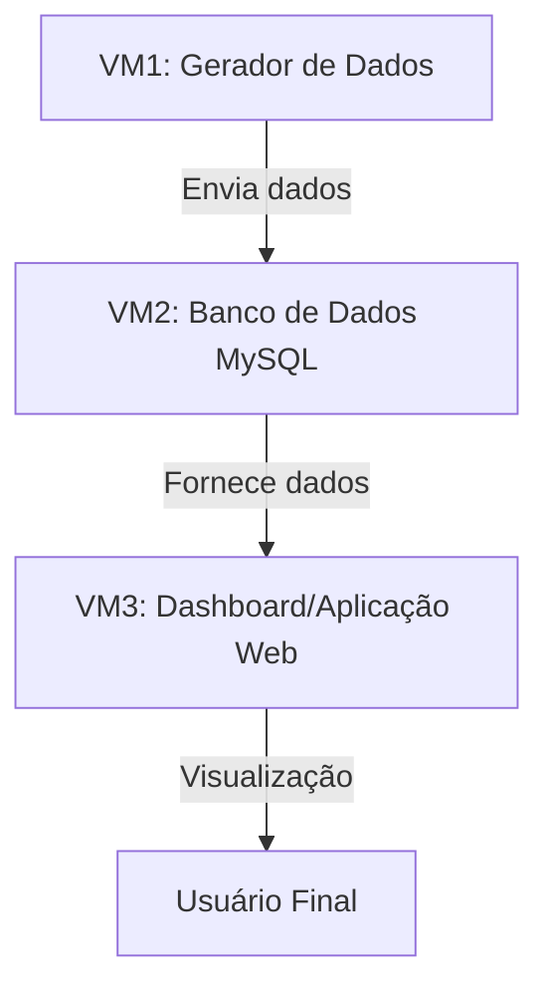

# UNIFEOB - PI Data Science 2025.1

**Título do Projeto:** Automação e Escalabilidade de Pipelines de Big Data  
**Subtítulo:** Impacto de doenças IST no Brasil

## 👥 Equipe

| Nome                              | RA       | Papel (SM/PO/Membro) | Responsabilidades                                                                                                                                                              |
| --------------------------------- | -------- | -------------------- | ------------------------------------------------------------------------------------------------------------------------------------------------------------------------------ |
| Caio Grilo da Cunha               | 22000246 | Product Owner        | Priorização de tarefas, validação de entregas, Entregas Gerais, Implementação de pipelines CI/CD e monitoramento de desempenho, Limpeza, transformação e visualização de dados |
| Gian Carlos de Freitas Moroni     | 22000843 | Scrum Master         | Gestão do cronograma, reuniões diárias, Aplicação estatísticos na análise de dados, Elaboração de modelos probabilísticos e geração de insights                                |
| Haryel Araújo de Oliveira Caliari | 22001470 | Membro               | Escalabilidade e Eficiência na infraestrutura de dados                                                                                                                         |
| Jackeline Ayumi Kanekiyo          | 22001803 | Membro               | Gerenciamento e processamento de dados, Implementação de arquiteturas distribuídas e Otimização da performance dos dados.                                                      |

## 📌 Objetivo do Projeto

Desenvolver um simulador de pipeline de dados em larga escala, integrando:

- Análise Exploratória de Dados (R).
- Big Data (Spark).
- DevOps (Vagrant e Docker/Kubernetes).

## 🔧 Ferramentas Utilizadas

- Python (Pandas, Matplotlib, Numpy, Faker, sklearn, nltk).
- R (Corrplot).
- Apache Spark.
- Docker/Kubernetes.

## 📆 Organização e Gestão de Tarefas

A equipe utilizará [ClickUp](https://app.clickup.com/9013521190/v/s/90132183959) para acompanhar o progresso das atividades, garantindo uma colaboração eficiente e uma boa distribuição de responsabilidades.

## 📂 Estrutura do Repositório

